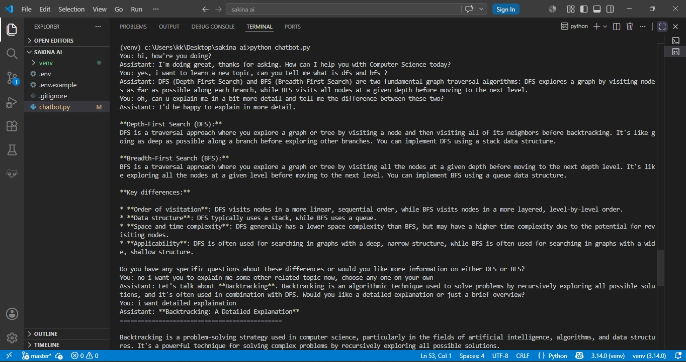
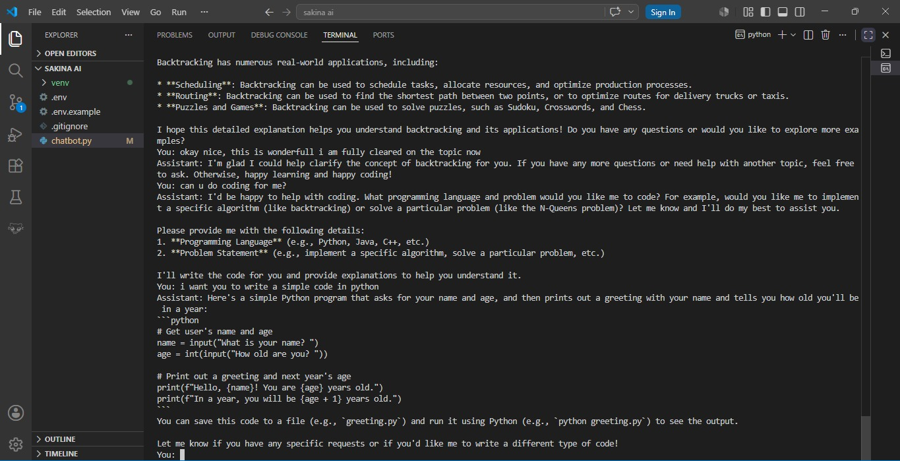

# CodeSage - AI Computer Science Learning Assistant

An AI-powered Computer Science learning chatbot built with LangGraph, LangChain, and the Groq API.

CodeSage is designed to help students learn Computer Science concepts through natural conversations. It can explain algorithms, data structures, databases, programming concepts, generate code examples, and maintain conversational context throughout a learning session.

---

## Features

* Explains Computer Science concepts in simple language
* Answers questions related to programming and software development
* Generates code snippets and examples
* Maintains short-term conversation memory
* Provides detailed explanations when requested
* Encourages topic exploration by suggesting related concepts
* Built using modern AI and agent frameworks

---

### Example Conversation
Learning Computer Science Concepts

User: What is BFS and DFS?

Assistant: BFS (Breadth-First Search) and DFS (Depth-First Search) are graph traversal algorithms. BFS explores level by level, while DFS explores as deep as possible before backtracking.

User: What is the difference between them?

Assistant: BFS uses a queue and explores nodes level-by-level. DFS uses a stack (or recursion) and explores deeper paths first.

### Python Code Generation

User: Write a simple Python program.

Assistant:

name = input("What is your name? ")
age = int(input("How old are you? "))

print(f"Hello, {name}!")
print(f"In a year, you will be {age + 1} years old.")

The chatbot can generate code examples and explain them to help students learn programming concepts.

---

## Screenshots

### Computer Science Learning Demo



### Python Code Generation Demo



---

## Technology Stack

* Python
* LangChain
* LangGraph
* Groq API
* python-dotenv

---

## Project Structure

```text
sakina-ai-chatbot/
│
├── images/
│   ├── chatbot.jpeg
│   └── pythoncodeexample.jpeg
│
├── chatbot.py
├── .env.example
├── .gitignore
├── requirements.txt
└── README.md
```

---

## Installation

Clone the repository:

```bash
git clone https://github.com/iemrizvi/sakina-ai-chatbot.git
cd sakina-ai-chatbot
```

Install dependencies:

```bash
pip install -r requirements.txt
```

Create a `.env` file:

```env
GROQ_API_KEY=your_api_key_here
```

Run the chatbot:

```bash
python chatbot.py
```


---

## Author

Developed by Sakina Rizvi as a learning project to explore AI chatbots, LangGraph workflows, conversational memory, and Computer Science education.
